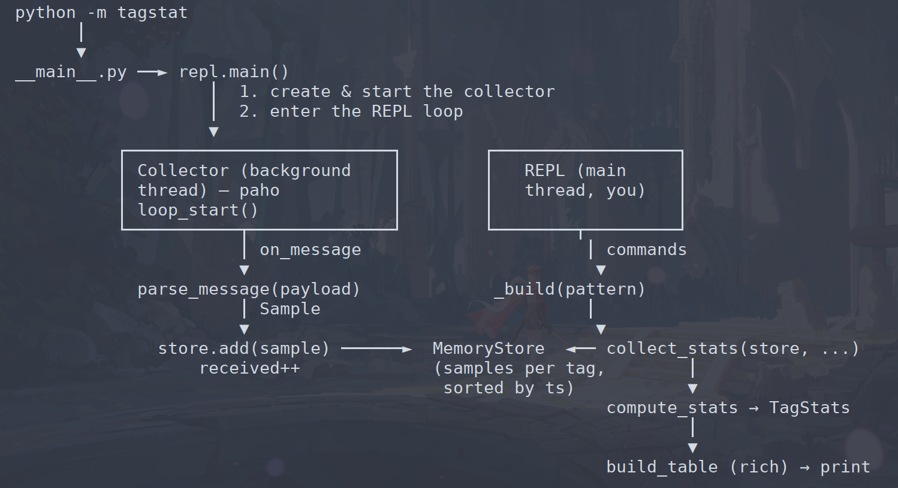

### Installation

```
git clone git@github.com:Romwierz/tagstat.git && cd tagstat
python3 -m venv .env && . .env/bin/activate
pip install -r requirements.txt
```

### Usage

```
# Run (default host is 192.168.2.145) 
python -m tagstat <host>

# List ids of available tags
tagstat> tags

# Show or watch stats of a tag
tagstat> show|watch <tag-id>

# Show help
tagstat> help
```

### Architecture

The collector and the display run on two threads sharing one `Store`: the
collector writes, the REPL reads.

  

1. **Start.**  
`__main__.py` calls `repl.main()`, which creates
   `Collector(broker).start()` and enters `cmdloop()`.
2. **Collector (background thread).**  
After `loop_start()`, paho runs a separate
   thread that connects to the broker, subscribes to `engine/+/positions`, and
   calls `on_message` for every message.
3. **on_message.**  
`parse_message(payload)` turns the raw JSON into a `Sample`
   (`tag_id, x, y, ts, is_moving`) and `store.add(sample)`. Success → `received++`,
   parse error → `errors++`.
4. **Store.**  
`MemoryStore` keeps samples per tag, sorted by time (bisect), so a
   time window can be sliced quickly.
5. **REPL (your thread).**  
On `show <tag-id>` / `watch <tag-id>`, `_build()` calls
   `collect_stats(store, pattern=...)`: it selects matching tags, resolves the
   window per tag (`timewin`), queries the samples in that window, runs
   `compute_stats`, sorts, trims to top-N, then `build_table` (rich) prints it.
6. **watch.**  
The same in a loop under `rich.Live`, every `interval` seconds — the
   background collector keeps appending data, so each redraw reflects fresh stats.

#### Modules description


| Module | Role |
|---|---|
| `model.py` | `Sample` — one position measurement. |
| `parse.py` | `parse_message()` — raw MQTT JSON → `Sample`. |
| `store.py` | `Store` protocol + `MemoryStore` (per-tag, time-windowed). |
| `stats.py` | `compute_stats()` → `TagStats` (mean, std, rms, error, moving). |
| `timewin.py` | Parse verbal windows like `last 10 min`. |
| `render.py` | Tag selection + stats + sort/top-N → rich table. |
| `collector.py` | `Collector` — background MQTT thread filling a `Store`. |
| `repl.py` | Interactive console (`cmd.Cmd`). |


